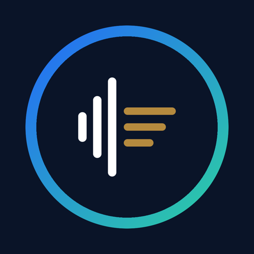
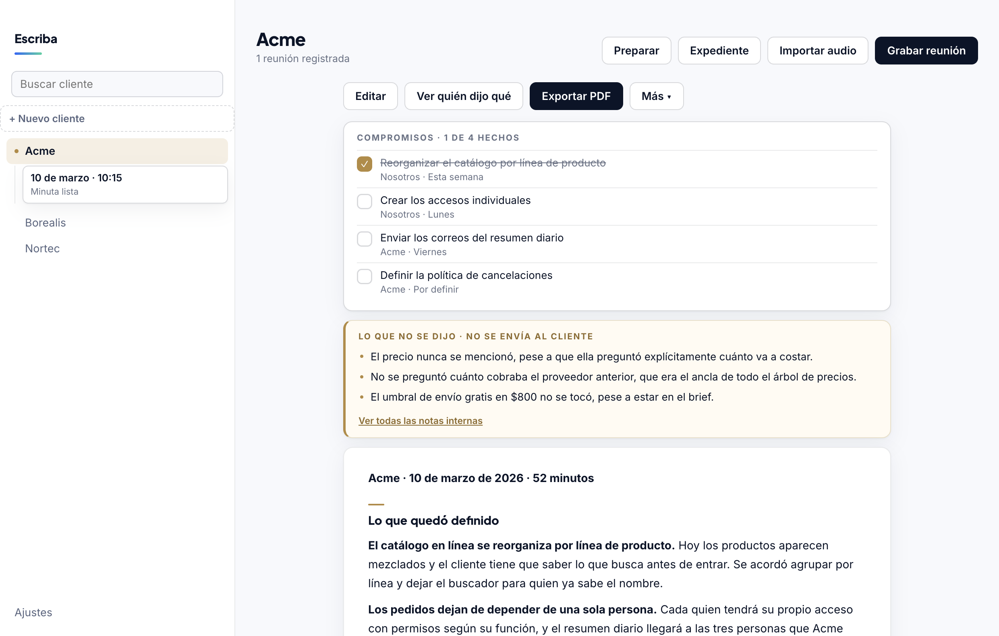
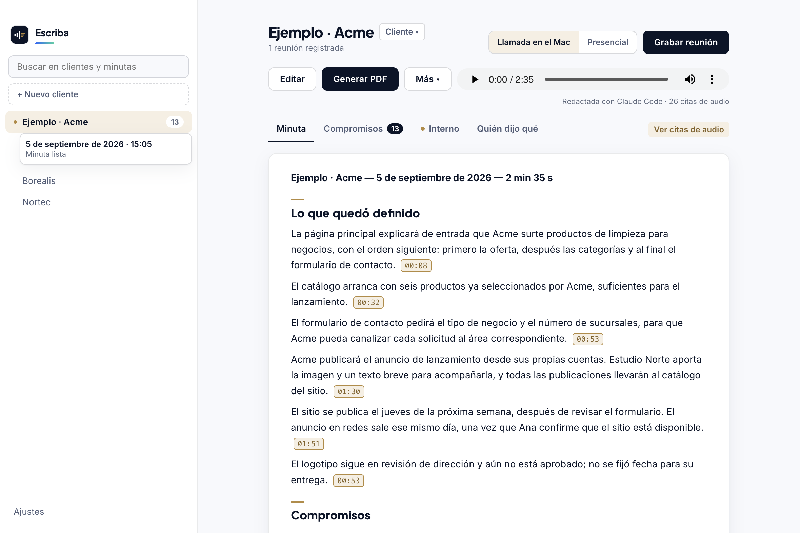
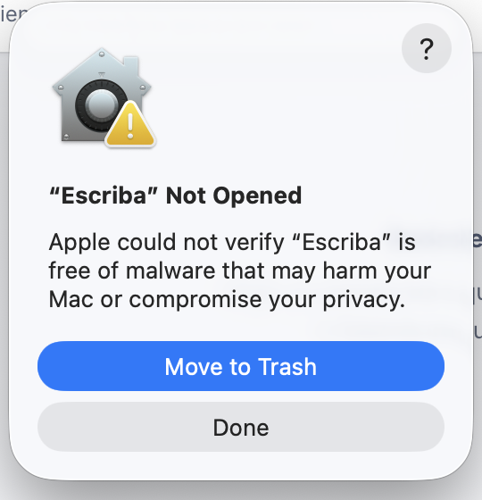
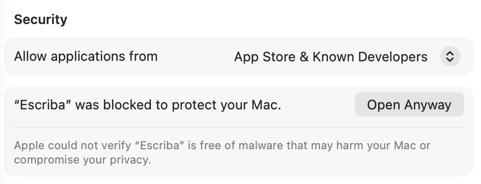

<p align="center">
  
</p>

<h1 align="center">Escriba</h1>

<p align="center">
  <b>The meeting assistant that tells you what was <i>never</i> said.</b><br>
  Records both sides, transcribes on your Mac, and checks the conversation
  against the client's open items — not just what happened, but what didn't.
</p>

<p align="center">
  
  
  
  
  <a href="README.es.md"></a>
</p>

<p align="center">
  
</p>

---

## What you get in 5 minutes

- **A minute ready to send.**
- **Commitments you can play back** — every one links to the moment it was said.
- **What was never said** — the open items nobody raised, checked against the client's file.

The path there: install → Settings installs the rest → **Help › Try with a
sample meeting** shows you all three before your first real call.

---

## What was never said

Every notetaker summarizes what happened. Escriba also reports **what should
have happened and didn't** — checked against the client's own file:

> **The budget was never mentioned.** Fifty minutes discussing scope and nobody
> asked the price. Most urgent open item.
>
> **The email addresses are still pending from the previous meeting.** Two weeks,
> and the daily summary is still off for want of three addresses.

That section is marked *internal* and is stripped from the PDF you send. As far
as I can tell, no other tool — commercial or open source — does this. Several
read prior context; none flag the absences.

If you already keep a folder with one Markdown file per client, Escriba loads
the relevant one before writing. That is the whole setup.

## Verify against the audio

Every commitment in the checklist, every line under "What was settled," and
every finding in the internal notes carries the moment of the recording where
it was said: an `mm:ss` chip you click to hear it. The **Minute** tab — exactly
what the client receives — hides them by default; a **View audio quotes**
switch turns them on for your own reading. They never reach the PDF, the
copied minute, or the client history.

<p align="center">
  
</p>

A quote tells you **where** something was said, so you can check it — it does
not certify that the claim itself is correct. Escriba only keeps a citation
that matches a real timestamp from the recording; anything the model invents
is stripped before saving, and the header states the count: "Drafted with
Claude Code · 6 audio citations."

Granola deletes the audio once it processes a meeting, and people ask how to
verify a quote after the fact. Escriba keeps the audio and links every quote
back to it.

## And a couple of engineering notes

### Speaker attribution without a diarization model

Escriba records **two separate tracks** — your microphone and the Mac's system
audio. To label a line, it compares the RMS energy of both tracks over that
segment and picks the louder one, with a 2 dB margin so overlapping speech
inherits the previous speaker.

That is the whole trick. No pyannote, no cloud service, no extra model —
about 80 lines in [`lib/voces.js`](lib/voces.js). It only works because the
two sides were never mixed in the first place, which is also why it is exact
for video calls and useless for a single-microphone room recording. Honest
trade-off, stated up front.

```
[00:00] You:    So the free-shipping threshold is still at 800.
[00:09] Client: Right. I'll send you the addresses on Monday.
```

### Capturing system audio without a driver

A 98 KB Swift helper built on ScreenCaptureKit, compiled with `swiftc` — **no
Xcode needed**, the Command Line Tools SDK is enough. It writes the microphone
and the system output to two AAC files at once, already in sync.

Electron's own `getDisplayMedia({audio:'loopback'})` looks like it works —
`getAudioTracks()` returns a track and `MediaRecorder` starts without error —
but the resulting file has no audio stream at all. That dead end is why the
helper exists.

## Compared to the alternatives

|  | Escriba | Granola / Fireflies | MacWhisper / Superwhisper |
|---|---|---|---|
| Audio leaves your Mac | never | yes | never |
| Works on video calls | yes | yes | needs a virtual driver |
| Knows who said what | yes, from two tracks | yes, cloud diarization | no |
| Uses your client history | yes | partly | no |
| **Flags what was _not_ said** | **yes** | **no** | **no** |
| Verify a claim against the audio | yes, every commitment links to the moment | no (Granola deletes the audio) | no |
| Spanish | first-class | translated | transcription only |
| Price | free, MIT | $10–29 / user / month | one-off purchase |

What they do better: polished onboarding, calendar integrations, mobile apps,
teams and sharing. Escriba has none of that.

**Who it is for:** independent consultants and small firms — lawyers,
accountants, agencies — who already keep a folder per client, work in Spanish,
and would rather their audio never reached a server in another country.

## Install

Download the `.dmg` from [Releases](https://github.com/kapitecsoluciones/escriba/releases)
and drag it to Applications.

**Requirements**

- [ ] macOS 15 or newer, Apple Silicon
- [ ] [Homebrew](https://brew.sh) — the one thing the app cannot install for
      you. From there, Settings installs `ffmpeg`, `whisper-cpp` and the
      1.5 GB transcription model
- [ ] Something to write the minute with: if you already use the **Claude
      Code CLI** (2.1.246+) or the **Codex CLI** (0.149.1+) with an active
      session, you need nothing else. Otherwise, Settings detects the gap and
      offers **Install Ollama** — free, local, about 5 GB of model — with one
      click. An API key of your own also works, and the default Automatic
      mode tries all of them in order, skipping whatever is unavailable.

**First launch**

The app is not notarized, and on macOS 15+ the old right-click → *Open* no
longer exists. This is what you get instead:

<p align="center">
  
  
</p>

1. macOS shows **"Escriba" Not Opened**, with **Move to Trash** highlighted
   and **Done** beside it. Click **Done** — not the highlighted button.
2. Open **System Settings › Privacy & Security**, scroll down to **Security**,
   and click **Open Anyway** next to "Escriba was blocked to protect your
   Mac."
3. Confirm with your password or Touch ID.
4. Open Escriba again. This is a one-time step.

Prefer the terminal? `xattr -dr com.apple.quarantine /Applications/Escriba.app`
clears the same quarantine flag without the dialogs.

## In-person meetings

Escriba was built for video calls: your microphone is you, the Mac's audio is
the other side. That is what makes speaker attribution possible without a
diarization model.

**In person there is only one track with voices, so speakers are not
separated** — and Escriba says so rather than guessing. It tells the writing
engine not to invent attributions either, because a commitment with no owner is
better than a commitment with the wrong owner in a document you send to a
client.

You can pick which microphone records. With an iPhone nearby and Continuity
enabled, its microphone shows up in the list — useful across a table, where a
laptop microphone struggles.

## While it works

Transcription takes about a minute per ten minutes of meeting, and the app
shows the real percentage while it runs — whisper reports it and Escriba reads
it rather than showing a frozen message. **Cancel** stops whisper, ffmpeg and
the writing engine, not just the spinner.

Commitments are lifted out of the minute into a checklist you can tick and copy,
and what was *never said* is summarised at the top instead of buried at the
bottom. Clicking a timestamp in the transcript plays that moment, so you can
check a quote before sending the PDF.

Nothing you type is lost: saving keeps the previous version, re-drafting keeps
the previous version, and leaving a half-edited minute asks first. Deleting a
meeting moves it to the Trash and never touches anything outside the meetings
folder.

## Sample meeting

**Help › Try with a sample meeting** installs a fictional client — "Ejemplo ·
Acme" — with a ~2.5-minute two-track video call and a dossier that already
carries open items. In about three minutes you get the transcript, who-said-
what, a minute with audio citations and, under Internal, what "what was never
said" looks like with a real dossier: the price is never brought up on the
call, and the dossier had it as a pending item. No microphone or
screen-recording permission needed. Use it to see the whole app before your
first real meeting.

## Diagnostics

**Help › Copy diagnostics** (also under Settings › Help and diagnostics)
copies a plain-text report — version, macOS, binaries, available engines,
permissions, folders — with your username stripped out, ready to paste into
wherever you're asking for help. **Help › Report a problem…** opens GitHub's
issue form, with templates in Spanish.

## Tests

```bash
npm test        # node --test "test/*.test.js"
```

More than 200 tests over `lib/`, no dependencies beyond Node itself. They cover the
Markdown converter's three former hang cases, the 2 dB margin that decides who
said what, config merging, the exact heading the internal-notes filter depends
on, and PDF escaping. Each was checked by breaking the code on purpose — a
suite that cannot fail is not a suite.

## Build from source

```bash
git clone https://github.com/kapitecsoluciones/escriba.git
cd escriba && pnpm install
pnpm run nativo   # compiles the Swift capture helper
pnpm start
```

`pnpm run dist` produces the `.dmg`. **Zero production dependencies** — the
whole app runs on Electron plus what macOS already ships.

## Who writes the minute

Your choice, and the app states in plain words what leaves the machine:

| Engine | What leaves your Mac |
|---|---|
| Automatic | The transcript, memory, and linked dossier may reach multiple engines, in order, until one answers |
| Claude Code | The transcript, memory, and linked dossier, to Anthropic |
| Codex | The transcript, memory, and linked dossier, to OpenAI |
| Your own API key | The transcript, memory, and linked dossier, to your provider |
| Ollama | Nothing |

Audio never leaves, with any of them. Keys live in the macOS Keychain.

## One thing you should know

Escriba records conversations. **Telling the other people that you are
recording is your responsibility**, and in many places it is a legal
requirement. The app will not do it for you.

## License

MIT © [Kapitec Soluciones](https://kapitec.pro) · [escriba.kapitec.pro](https://escriba.kapitec.pro)
